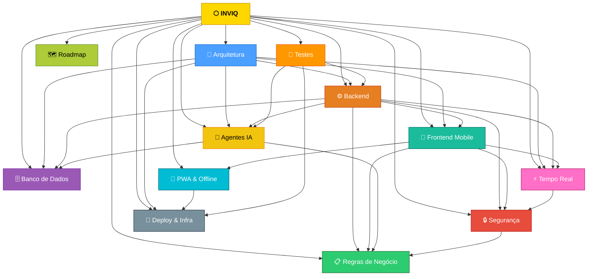

# INVIQ — Sistema de Inventário Físico por QR Code

> [!abstract] Sistema
> **Produto:** Inventário físico em tempo real com QR Code, IA e PWA
> **Stack:** FastAPI · PostgreSQL · Vanilla JS · Claude AI · Docker · Railway
> **Status:** ✅ Produção — 395 testes passando · PWA instalável · 9 vulnerabilidades corrigidas

---

## Mapa do Sistema

---

## Visão Executiva

| Dimensão | Detalhe |
|----------|---------|
| **Propósito** | Substituir planilhas manuais por scanner mobile com IA integrada |
| **Operadores** | Acesso via QR Code + token rotativo por rodada |
| **Contagem** | Cega (operador não vê quantidade esperada — elimina viés) |
| **Rodadas** | R1 todos os itens → R2 divergentes → R3 persistentes → Para Ajuste |
| **Tempo real** | WebSocket atualiza progresso, alertas e status para todos os clientes |
| **IA** | 10 agentes Claude para validação, análise, predição e suporte |
| **Offline** | PWA com Service Worker — conta sem internet, sincroniza ao voltar |

---

## Navegação por Área

| Área | Nota | O que encontrar |
|------|------|-----------------|
| 📐 Estrutura | [[01 - Arquitetura]] | Stack, decisões técnicas, componentes |
| 🗄️ Dados | [[02 - Banco de Dados]] | Modelos, relações, migrations |
| ⚙️ API | [[03 - Backend]] | Endpoints, serviços, autenticação |
| 📱 Scanner | [[04 - Frontend Mobile]] | Estados, câmera, lista, UX |
| 🤖 IA | [[05 - Agentes IA]] | 10 agentes, hierarquia, provider |
| ⚡ Live | [[06 - Tempo Real]] | WebSocket, eventos, broadcast |
| 🔒 Auth | [[07 - Segurança]] | Tokens, CSP, rate limit, auditoria |
| 📋 Processo | [[08 - Regras de Negócio]] | Rodadas, divergências, grupos |
| 📲 Offline | [[09 - PWA & Offline]] | Service Worker, cache, Background Sync |
| 🚀 Infra | [[10 - Deploy & Infra]] | Docker, Railway, variáveis |
| 🗺️ Futuro | [[11 - Roadmap]] | Próximas features, fases |
| 🧪 QA | [[12 - Testes]] | 395 testes, cobertura, estrutura |
