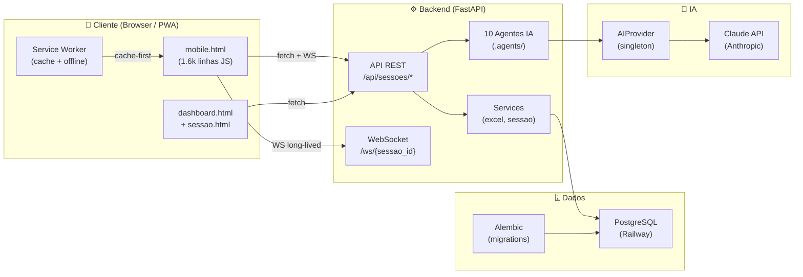
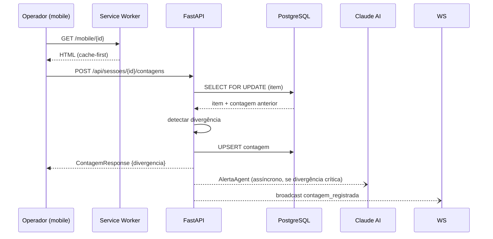

# Arquitetura — INVIQ

> [!info] Stack Resumida
> `FastAPI` + `SQLAlchemy` + `PostgreSQL` + `Vanilla JS` + `Claude AI` + `Docker` + `Railway`
> Monolito deliberado — backend serve HTML, static assets e API pelo mesmo processo

---

## Diagrama de Componentes



---

## Decisões Técnicas

| Decisão | Escolha | Motivo |
|---------|---------|--------|
| **Frontend** | Vanilla JS (mobile.html) | Zero build step, funciona offline, mobile-first extremo |
| **Backend** | FastAPI (Python) | Async nativo, WebSocket built-in, Pydantic para validação |
| **Banco** | PostgreSQL | Transações ACID, `SELECT ... FOR UPDATE` para contagem concorrente |
| **ORM** | SQLAlchemy 2.x | Projeção de colunas, upsert, relacionamentos |
| **Auth** | Token alfanumérico 8 chars | Sem JWT → operadores sem login. Simples, seguro para o caso de uso |
| **IA** | Anthropic Claude | Haiku (rápido/barato) + Sonnet (análise pesada). Fallback determinístico |
| **Deploy** | Railway | PostgreSQL + backend em um único lugar, CI/CD automático via git |
| **Agents path** | `.agents/{nome}/{nome}.py` | Separação de concerns; carregados por `importlib` na startup |

---

## Fluxo de Request



---

## Estrutura de Pastas

```
inventario-qr/
├── .agents/                 ← Agentes IA (carregados por importlib)
│   ├── ajuste/
│   ├── alerta/
│   ├── analise/
│   ├── antifraude/
│   ├── chat/
│   ├── plano_acao/
│   ├── preditor/
│   ├── provider/
│   ├── relatorio/
│   ├── sop_coach/
│   ├── sync_erp/
│   └── validation/
├── backend/
│   ├── app/
│   │   ├── agents/          ← __init__.py (loader via importlib)
│   │   ├── models/          ← SQLAlchemy models
│   │   ├── repositories/    ← acesso a dados
│   │   ├── routes/          ← endpoints FastAPI
│   │   ├── services/        ← lógica de negócio
│   │   └── websockets/      ← WS manager
│   ├── static/              ← HTML + CSS + JS + SW + icons
│   └── tests/               ← 395 testes pytest
├── docker-compose.yml
├── render.yaml
└── obsidian/                ← este vault
```

---

## Conexões

- [[02 - Banco de Dados]] — models, schemas, migrations
- [[03 - Backend]] — rotas, serviços, endpoints
- [[04 - Frontend Mobile]] — mobile.html, scanner
- [[05 - Agentes IA]] — .agents/, provider, hierarquia
- [[06 - Tempo Real]] — WebSocket manager
- [[10 - Deploy & Infra]] — Docker, Railway, env vars
- [[00 - INVIQ]] — visão geral
