# Banco de Dados — INVIQ

> [!info] Configuração
> **Engine:** PostgreSQL 16 (Railway em prod · Docker local)
> **ORM:** SQLAlchemy 2.x com projeção de colunas
> **Migrations:** Alembic (versionado em `backend/alembic/versions/`)

---

## Diagrama Entidade-Relacionamento

```mermaid
erDiagram
    SESSAO {
        uuid id PK
        string codigo "INV-AAAA-NNNN"
        string nome
        string status "ativa | pausada | concluida | cancelada"
        string token_admin
        int rodada_atual
        timestamp criada_em
        timestamp atualizada_em
    }

    ITEM {
        uuid id PK
        uuid sessao_id FK
        string codigo
        string produto
        float quantidade_base
        string local_fisico
        float valor_estoque
    }

    CONTAGEM {
        uuid id PK
        uuid sessao_id FK
        string codigo
        string operador
        float quantidade_encontrada
        int rodada
        bool divergencia
        bool para_ajuste
        timestamp registrada_em
    }

    HISTORICO_CONTAGEM {
        uuid id PK
        uuid sessao_id FK
        string codigo
        string operador
        float quantidade_encontrada
        int rodada
        timestamp registrada_em
    }

    GRUPO_OPERADOR {
        uuid id PK
        uuid sessao_id FK
        string nome
        string token "8 chars alfanum"
        string filtro "prefixos CSV ou *"
        string tipo_filtro "prefixo | lista | todos"
        string cor
    }

    AUDITORIA {
        uuid id PK
        uuid sessao_id FK
        string acao
        string usuario
        jsonb detalhes
        timestamp criada_em
    }

    SESSAO ||--o{ ITEM : "tem"
    SESSAO ||--o{ CONTAGEM : "registra"
    SESSAO ||--o{ HISTORICO_CONTAGEM : "historico"
    SESSAO ||--o{ GRUPO_OPERADOR : "grupos"
    SESSAO ||--o{ AUDITORIA : "auditoria"
    ITEM ||--o| CONTAGEM : "contagem atual"
```



---

## Padrões de Acesso

### Upsert de Contagem (concorrência segura)
```python
# SELECT FOR UPDATE garante que 2 operadores no mesmo item não criam race condition
db.query(Contagem).filter(...).with_for_update().first()
```

### Projeção de Colunas (performance)
```python
# Correto — carrega apenas o campo necessário
codigos = {row[0] for row in db.query(Contagem.codigo).filter(...)}

# Incorreto — carrega ORM completo só para .codigo
codigos = {c.codigo for c in db.query(Contagem).filter(...).all()}
```

### Contagem Cega (sem `quantidade_base`)
```python
# listar_itens_para_operador() retorna dict sem quantidade_base
return [{"codigo": ..., "produto": ..., "local_fisico": ..., "ja_contado": ...}]
```

---

## Índices e Constraints

| Tabela | Índice | Tipo |
|--------|--------|------|
| `contagem` | `(sessao_id, codigo)` | UNIQUE — 1 contagem por item |
| `item` | `(sessao_id, codigo)` | UNIQUE — 1 item por sessão |
| `grupo_operador` | `(sessao_id, token)` | UNIQUE — token único por sessão |
| `historico_contagem` | `sessao_id` | INDEX — filtros rápidos |

---

## Status do Schema

| Modelo | Arquivo | Status |
|--------|---------|--------|
| `Sessao` | `models/sessao.py` | ✅ Produção |
| `Item` | `models/item.py` | ✅ Produção |
| `Contagem` | `models/contagem.py` | ✅ Produção |
| `HistoricoContagem` | `models/historico_contagem.py` | ✅ Produção |
| `GrupoOperador` | `models/grupo_operador.py` | ✅ Produção |
| `Auditoria` | `models/auditoria.py` | ✅ Produção |

---

## Conexões

- [[01 - Arquitetura]] — decisões de stack e ORM
- [[03 - Backend]] — repositories que acessam este schema
- [[05 - Agentes IA]] — agentes lêem contagens e divergências
- [[08 - Regras de Negócio]] — regras que moldam o schema (rodadas, Para Ajuste)
- [[00 - INVIQ]] — visão geral
