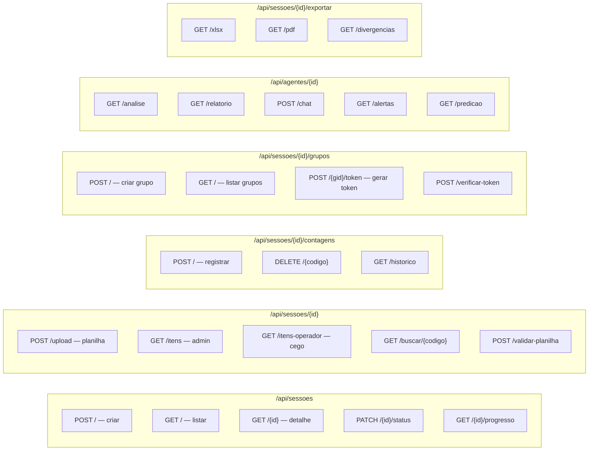
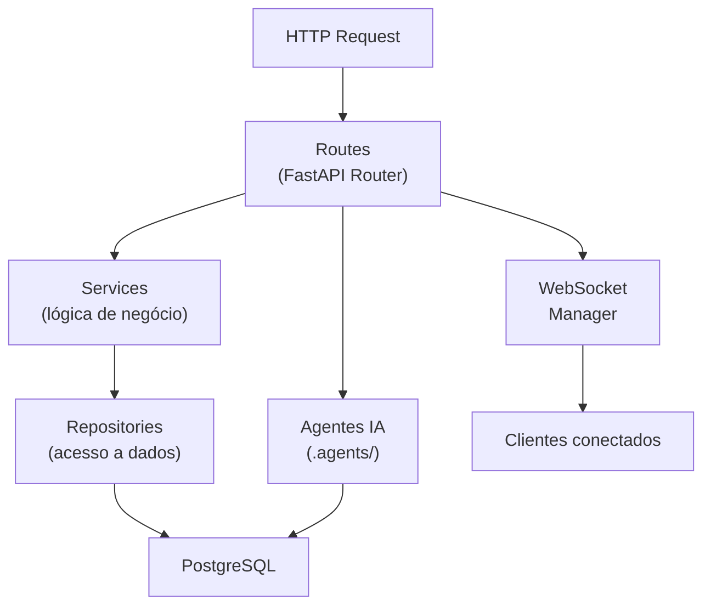

# Backend — INVIQ

> [!info] FastAPI
> **Framework:** FastAPI 0.115 · **Python:** 3.12
> **Processo:** Uvicorn (ASGI) · **Rate Limit:** SlowAPI
> **Rotas:** 17 módulos · Arquitetura: Routes → Services → Repositories → Models

---

## Mapa de Endpoints



---

## Camadas da Aplicação



---

## Repositórios

| Arquivo | Responsabilidade |
|---------|-----------------|
| `sessao_repo.py` | CRUD de sessões, busca, status |
| `item_repo.py` | Import bulk, busca, lista operador (cega) |
| `contagem_repo.py` | Upsert contagem, histórico, deletar |
| `grupo_repo.py` | Grupos de operadores, `buscar_grupo_por_token()` |
| `auditoria_repo.py` | Log append-only de ações |

---

## Middleware e Segurança

```python
# main.py — camadas em ordem de execução
app
  → GZipMiddleware          # compressão automática
  → SecurityHeadersMiddleware  # CSP, HSTS, X-Frame
  → CORSMiddleware          # origens permitidas
  → SlowAPI (rate limiter)  # 60/min operadores, 10/h uploads
```

---

## Padrões de Código

### Endpoint padrão (com limiter + auth)
```python
@router.post("/{sessao_id}/contagens", response_model=ContagemResponse)
@limiter.limit("120/minute")
async def registrar_contagem(
    request: Request,
    sessao_id: str,
    payload: ContagemCreate,
    db: Session = Depends(get_db),
):
    sessao = sessao_repo.buscar_sessao(db, sessao_id)
    if not sessao:
        raise HTTPException(status_code=404, detail="Sessão não encontrada")
    if sessao.status != StatusSessao.ativa:
        raise HTTPException(status_code=409, detail="Sessão não está ativa")
    # ...
```

### Filtro de grupo (contagem cega)
```python
# /itens-operador respeita o grupo do token
if token:
    grupo = grupo_repo.buscar_grupo_por_token(db, sessao_id, token)
    if grupo:
        itens = _filtrar_por_grupo(itens, grupo)
```

---

## Conexões

- [[01 - Arquitetura]] — estrutura geral e decisões
- [[02 - Banco de Dados]] — repositories e models
- [[04 - Frontend Mobile]] — consome esta API
- [[05 - Agentes IA]] — chamados pelos routes
- [[06 - Tempo Real]] — WebSocket emitido pelos routes
- [[07 - Segurança]] — middleware, tokens, CSP
- [[08 - Regras de Negócio]] — implementadas nos services
- [[12 - Testes]] — testes de integração por endpoint
- [[00 - INVIQ]] — visão geral
