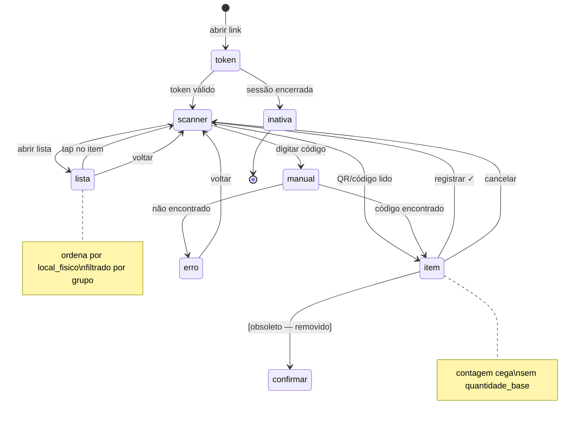
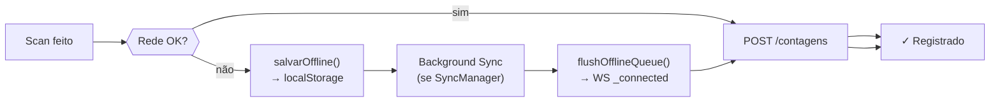

# Frontend Mobile — INVIQ

> [!info] Scanner de Campo
> **Arquivo:** `backend/static/mobile.html` — ~1.650 linhas de Vanilla JS
> **UX:** Mobile-first · câmera traseira · vibração háptica · offline
> **Design:** Tailwind CSS CDN · Material Symbols · JetBrains Mono · tema escuro

---

## Máquina de Estados do Scanner



---

## Componentes de UI

| Estado | Elemento DOM | Finalidade |
|--------|-------------|------------|
| `scanner` | `#state-scanner` | Câmera ativa, botões de ação |
| `item` | `#state-item` | Detalhes do item + input de quantidade |
| `manual` | `#state-manual` | Campo de texto + fuzzy search |
| `lista` | `#state-lista` | Lista completa com busca e filtros |
| `confirmar` | `#state-confirmar` | Confirmação (legado — não disparado mais) |
| `rodada-completa` | `#state-rodada-completa` | Celebração de rodada finalizada |
| `inativa` | `#state-inativa` | Sessão pausada/cancelada/concluída |
| `token` | `#state-token` | Input de token de acesso |

---

## Fuzzy Search

```
carregarItensParaFuzzy()
  ↓
  1. Se itensCache já preenchido → retorna (cache hit)
  2. Se itensLista já carregado → copia para itensCache (sem fetch)
  3. Caso contrário → GET /itens-operador?token=... (endpoint cego)

fuzzyScore(item, query)
  → pontuação por: código exato > início > produto > local
  → threshold mínimo para aparecer na sugestão
```

---

## Offline Queue



---

## Teclado Mobile (visualViewport)

```javascript
// Estados que respondem ao teclado virtual
const _KBD_STATES = new Set(['item', 'manual', 'lista'])
// 'lista' incluído para que a busca não fique coberta pelo teclado
// visualViewport.height clamping evita overflow em iOS/Android
```

---

## Grupos de Operadores (Filtro)

```
GrupoInfo { nome, filtro, tipo_filtro }
  tipo_filtro = 'prefixo' → item.codigo.startsWith(prefixo)
  tipo_filtro = 'lista'   → item.codigo === codigo_exato
  tipo_filtro = 'todos'   → sem filtro (admin view)
  filtro = '*'            → sem filtro independente do tipo
```

---

## Páginas Estáticas

| Arquivo | Papel |
|---------|-------|
| `index.html` | Lista de sessões (admin) |
| `sessao.html` | Detalhe da sessão, upload, grupos |
| `dashboard.html` | Overview em tempo real |
| `mobile.html` | Scanner de campo (operadores) |
| `supervisor.html` | Painel do supervisor por sessão |

---

## Conexões

- [[03 - Backend]] — consome a API REST e WebSocket
- [[06 - Tempo Real]] — recebe eventos WS (contagem_registrada, etc.)
- [[07 - Segurança]] — token de acesso, CSP, XSS prevention
- [[08 - Regras de Negócio]] — contagem cega, rodadas, grupos
- [[09 - PWA & Offline]] — Service Worker, fila offline
- [[00 - INVIQ]] — visão geral
