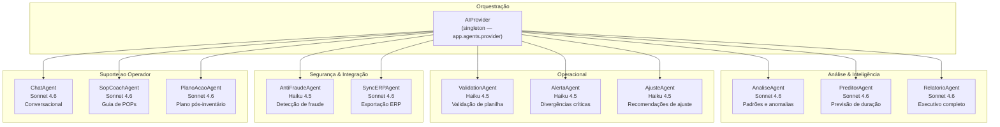

# Agentes IA — INVIQ

> [!info] Sistema de Agentes
> **10 agentes** especializados · **Modelos:** Claude Sonnet 4.6 + Haiku 4.5
> **Fallback:** resposta determinística quando API offline
> **Localização:** `.agents/{nome}/{nome}.py` → carregados por `importlib` na startup

---

## Hierarquia de Agentes



---

## Cada Agente em Detalhe

| Agente | Modelo | Trigger | Output |
|--------|--------|---------|--------|
| **ValidationAgent** | Haiku 4.5 | Upload de planilha | `{valido, erros, warnings, sugestoes}` |
| **AlertaAgent** | Haiku 4.5 | Divergência crítica (>100% ou >R$5k) | Alerta formatado + severidade |
| **AnaliseAgent** | Sonnet 4.6 | Admin solicita análise | Padrões, anomalias, riscos |
| **PreditorAgent** | Sonnet 4.6 | Durante sessão ativa | ETA, ritmo por hora, gargalos |
| **RelatorioAgent** | Sonnet 4.6 | Conclusão da sessão | PDF executivo com KPIs |
| **AjusteAgent** | Haiku 4.5 | Itens Para Ajuste | Recomendações por item |
| **AntiFraudeAgent** | Haiku 4.5 | Padrões suspeitos | Score de risco, flags |
| **SyncERPAgent** | Sonnet 4.6 | Exportação | Mapeamento para formato ERP |
| **ChatAgent** | Sonnet 4.6 | Admin conversa | Resposta contextual da sessão |
| **SopCoachAgent** | Sonnet 4.6 | Operador com dúvida | Guia passo-a-passo de POP |
| **PlanoAcaoAgent** | Sonnet 4.6 | Pós-inventário | Plano priorizado de ajustes |

---

## Carregamento Dinâmico

```python
# backend/app/agents/__init__.py
# Carrega .agents/{nome}/{nome}.py via importlib — sem cópias em /backend/
_AGENTS_ROOT = pathlib.Path(__file__).parents[3] / '.agents'

def _load(name: str):
    spec = importlib.util.spec_from_file_location(f'app.agents.{name}', f)
    mod = importlib.util.module_from_spec(spec)
    try:
        sys.modules[full] = mod
        spec.loader.exec_module(mod)  # executa DEPOIS de registrar
    except Exception:
        sys.modules.pop(full, None)   # limpa se falhar
        raise
```

> [!warning] Fallback Determinístico
> Todos os agentes têm `_fallback()` — retornam resposta útil mesmo sem API key.
> `provider.disponivel` é verificado antes de cada chamada Claude.

---

## AIProvider (Singleton)

```python
class AIProvider:
    disponivel: bool      # False se ANTHROPIC_API_KEY ausente
    modelo_padrao: str    # claude-haiku-4-5-20251001
    modelo_avancado: str  # claude-sonnet-4-6

    def completar_chat(self, messages, max_tokens) -> str | None: ...
    def completar(self, prompt, max_tokens) -> str | None: ...
```

---

## Conexões

- [[01 - Arquitetura]] — decisão `.agents/` e importlib
- [[02 - Banco de Dados]] — agentes lêem contagens/divergências
- [[03 - Backend]] — routes chamam os agentes
- [[08 - Regras de Negócio]] — agentes implementam regras de negócio avançadas
- [[11 - Roadmap]] — novos agentes planejados
- [[12 - Testes]] — `test_novos_agentes.py`, `test_validation_agent.py`
- [[00 - INVIQ]] — visão geral
