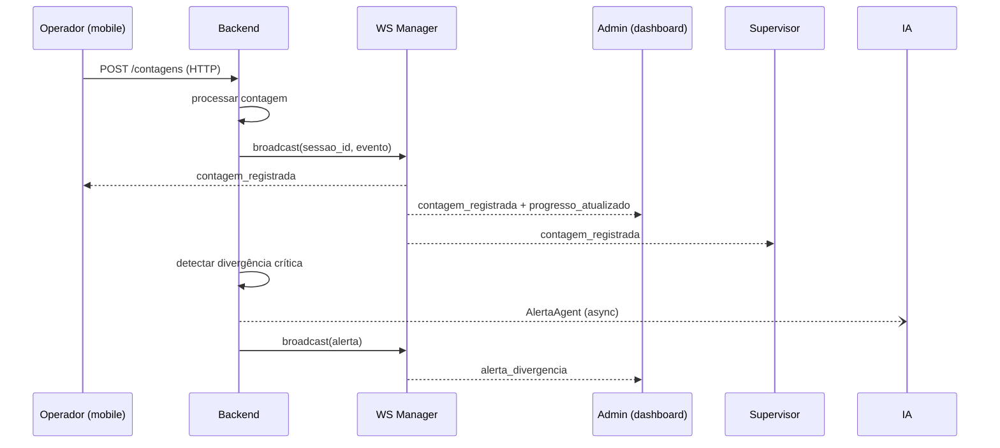
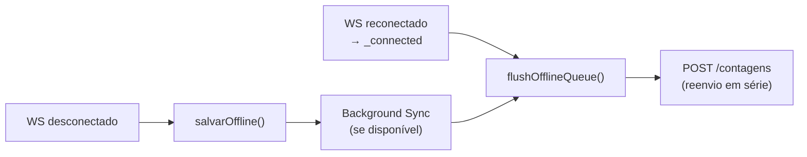

# Tempo Real — INVIQ

> [!info] WebSocket
> **Rota:** `ws://{host}/ws/{sessao_id}?token={token}`
> **Manager:** Singleton `ConnectionManager` em `backend/app/websockets/manager.py`
> **Reconexão:** automática com backoff exponencial no cliente (`ws.js`)

---

## Fluxo de Evento



---

## Catálogo de Eventos

| Evento | Direção | Payload | Quem consome |
|--------|---------|---------|--------------|
| `_connected` | Server → Client | `{}` | Todos — dispara `flushOfflineQueue()` |
| `_disconnected` | Server → Client | `{}` | Todos — atualiza indicador |
| `contagem_registrada` | Server → All | `{codigo, operador, quantidade, divergencia}` | mobile, admin, supervisor |
| `contagem_deletada` | Server → All | `{codigo, sessao_id}` | mobile — atualiza `itensLista` |
| `progresso_atualizado` | Server → All | `{rodada, faltando, total, contados, completa}` | mobile, admin |
| `rodada_completa` | Server → All | `{rodada, divergencias, proxima, tudo_concluido}` | mobile — mostra celebração |
| `sessao_status_alterado` | Server → All | `{status, mensagem}` | mobile — bloqueia scanner |
| `alerta_divergencia` | Server → Admin | `{codigo, delta, valor}` | admin, supervisor |

---

## ConnectionManager

```python
class ConnectionManager:
    active: dict[str, set[WebSocket]]  # sessao_id → {ws1, ws2, ...}

    async def connect(self, ws, sessao_id, token) -> bool
    async def disconnect(self, ws, sessao_id)
    async def broadcast(self, sessao_id, data: dict)
    async def send_personal(self, ws, data: dict)

    @property
    def active_count(self) -> int  # para /api/health
```

---

## Cliente JS (`ws.js`)

```javascript
// Wrapper com reconexão automática
class SessionWS {
    constructor(sessaoId, token, onMessage)
    connect()     // estabelece conexão
    disconnect()  // fecha limpo
    reconnect()   // backoff: 1s → 2s → 4s → 8s (max 30s)
}

// Uso em mobile.html
ws = new SessionWS(sessaoId, tokenAtivo, ev => {
    if (ev.tipo === 'contagem_registrada') { ... }
    if (ev.tipo === 'sessao_status_alterado') { ... }
})
```

---

## Integração com Offline Queue



---

## Conexões

- [[03 - Backend]] — `routes/ws.py` — endpoint WebSocket
- [[04 - Frontend Mobile]] — cliente WS em `mobile.html`
- [[07 - Segurança]] — token validado no handshake do WS
- [[09 - PWA & Offline]] — integração com offline queue e Background Sync
- [[00 - INVIQ]] — visão geral
