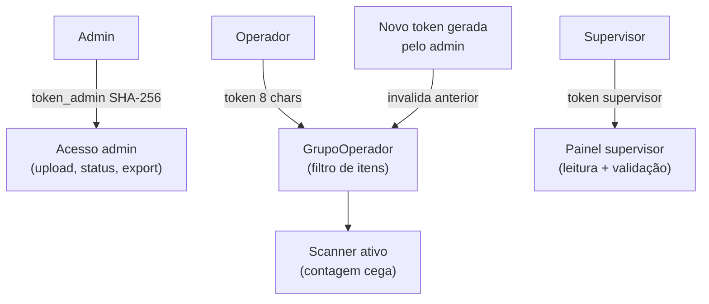

# Segurança — INVIQ

> [!warning] Auditoria Completa
> **9 vulnerabilidades** corrigidas em auditoria (Jun 2026)
> **Categorias:** SSRF, injection, tokens, DoS, formula injection, content-type
> **Estado:** Sem vulnerabilidades conhecidas abertas

---

## Modelo de Autenticação



---

## Tokens

| Token | Geração | Tamanho | Validade | Armazenagem |
|-------|---------|---------|---------|-------------|
| `token_admin` | `secrets.token_urlsafe(32)` hasheado SHA-256 | 32 chars | Vida da sessão | DB (hash) · nunca em plain |
| `token_grupo` | `secrets.token_urlsafe(6)` | 8 chars alfanum | Até próxima rotação | DB · enviado por QR Code |
| `token_supervisor` | `secrets.token_urlsafe(16)` | ~22 chars | Vida da sessão | DB · enviado por link |

---

## Headers de Segurança (SecurityHeadersMiddleware)

```
Content-Security-Policy:
  default-src 'self'
  script-src 'self' 'unsafe-inline' cdn.tailwindcss.com cdn.jsdelivr.net
  style-src 'self' 'unsafe-inline' fonts.googleapis.com
  font-src 'self' fonts.gstatic.com
  connect-src 'self' wss: ws:
  img-src 'self' data: blob:
  frame-ancestors 'none'
  base-uri 'self'
  form-action 'self'

X-Content-Type-Options: nosniff
X-Frame-Options: DENY
Referrer-Policy: strict-origin-when-cross-origin
Permissions-Policy: camera=(), microphone=(), geolocation=()  [prod]
```

---

## Rate Limiting

| Endpoint | Limite | Janela |
|----------|--------|--------|
| `POST /contagens` | 120 | / minuto |
| `GET /itens-operador` | 60 | / minuto |
| `GET /buscar/{codigo}` | 200 | / minuto |
| `POST /upload` | 10 | / hora |
| `POST /agentes/*` | 30 | / minuto |

---

## Vulnerabilidades Corrigidas

| # | Categoria | Fix aplicado |
|---|-----------|-------------|
| 1 | SSRF | Validação de URL antes de fetch externo |
| 2 | CSV Injection | Sanitização de `=`, `+`, `-`, `@` em exports |
| 3 | Token em log | Remoção de `logging.info(token)` |
| 4 | DoS upload | Limite de 10 MB + 50k linhas |
| 5 | Content-Type spoofing | Validação MIME + extensão no upload |
| 6 | XSS (renderLista) | `textContent` em vez de `innerHTML` para dados do usuário |
| 7 | IDOR (contagens) | Validação `sessao_id` antes de qualquer operação |
| 8 | Formula injection | Export Excel sanitiza valores começando em `=` |
| 9 | Token timing attack | Comparação com `hmac.compare_digest` |

---

## Contagem Cega (Privacy por Design)

> [!tip] Blind Counting
> O endpoint `/itens-operador` retorna `{codigo, produto, local_fisico, ja_contado}` — **sem `quantidade_base`**.
> O operador não sabe a quantidade esperada → elimina viés de confirmação → inventário mais preciso.
> `handleRegistrar()` não faz comparação prévia — divergência detectada apenas no servidor.

---

## Conexões

- [[03 - Backend]] — middleware, tokens, rate limiting
- [[04 - Frontend Mobile]] — `textContent` vs `innerHTML`, token no URL
- [[06 - Tempo Real]] — token validado no handshake WS
- [[08 - Regras de Negócio]] — token de rodada controla progressão
- [[00 - INVIQ]] — visão geral
