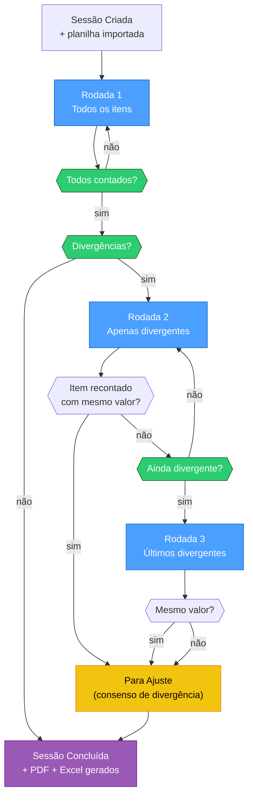
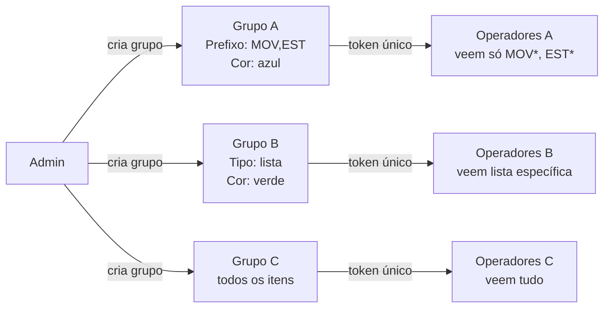

# Regras de Negócio — INVIQ

> [!abstract] O Processo de Inventário
> O INVIQ opera em **até 3 rodadas** por sessão.
> A contagem é **cega** — operadores não veem quantidades esperadas.
> Divergências persistentes viram **Para Ajuste** (consenso de erro de estoque).

---

## Fluxo de Rodadas

---

## Regras de Sessão

| Código | Regra |
|--------|-------|
| **RN-01** | Sessão aceita contagens apenas com status `ativa` |
| **RN-02** | Código único automático: `INV-AAAA-NNNN` |
| **RN-03** | Sessão concluída é imutável — não pode ser reaberta |
| **RN-04** | Reimport de planilha preserva contagens existentes |
| **RN-05** | Conclusão gera PDF executivo + Excel automaticamente |

---

## Regras de Contagem (Cega)

| Código | Regra |
|--------|-------|
| **RN-11** | Máximo 3 rodadas por sessão |
| **RN-12** | Item avança de rodada só se: foi divergente **e** nova qty ≠ qty anterior |
| **RN-13** | Mesmo valor na recontagem → Para Ajuste imediato (consenso) |
| **RN-14** | Após rodada 3, divergência persistente → Para Ajuste automático |
| **RN-15** | Operador não vê quantidade esperada (contagem cega — elimina viés) |

---

## Grupos de Operadores

| Campo | Valores | Efeito |
|-------|---------|--------|
| `tipo_filtro` | `prefixo` | filtra por início do código SKU |
| `tipo_filtro` | `lista` | filtra por lista exata de códigos |
| `tipo_filtro` | `todos` | sem filtro |
| `filtro` | `*` | sem filtro (independente do tipo) |
| `filtro` | `MOV,EST` | CSV de prefixos ou códigos |

---

## Divergências Críticas

> [!warning] Requer Supervisor
> Item com divergência **> 100%** do estoque esperado **ou** valor financeiro **≥ R$ 5.000**
> → AlertaAgent notifica o painel do supervisor imediatamente
> → Supervisor deve testemunhar a recontagem presencialmente

---

## Glossário

| Termo | Definição |
|-------|-----------|
| **Sessão** | Evento único de inventário |
| **Item Base** | Produto importado da planilha (código, produto, qtd esperada, valor) |
| **Contagem** | Registro do operador para um item em uma sessão (upsert) |
| **Rodada** | Ciclo: R1=todos, R2/R3=divergentes |
| **Divergência** | `qty_encontrada ≠ qty_base` |
| **Para Ajuste** | Divergência confirmada — ajuste direto no ERP |
| **Contagem Cega** | Operador conta sem saber o esperado |

---

## Conexões

- [[02 - Banco de Dados]] — schema implementa estas regras (upsert, UNIQUE)
- [[03 - Backend]] — services aplicam as regras no CRUD
- [[04 - Frontend Mobile]] — scanner respeita contagem cega e grupos
- [[05 - Agentes IA]] — AlertaAgent e AjusteAgent implementam regras avançadas
- [[07 - Segurança]] — token de rodada controla progressão
- [[00 - INVIQ]] — visão geral
