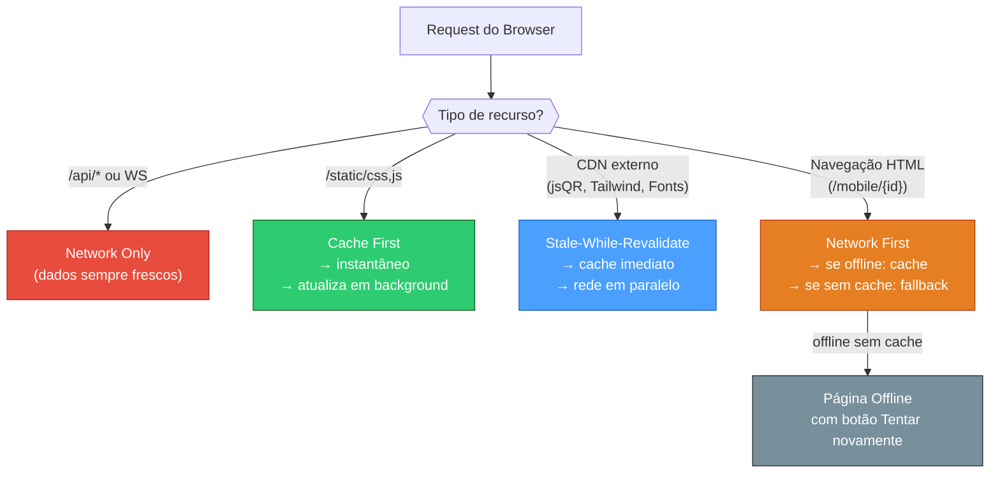
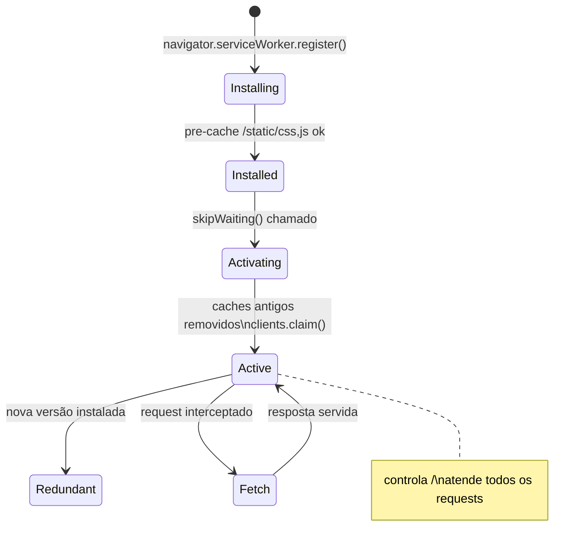
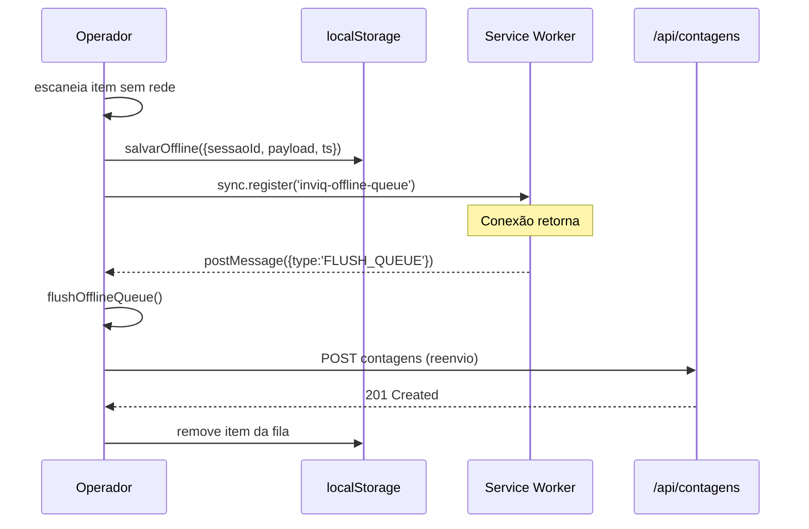

# PWA & Offline — INVIQ

> [!info] Progressive Web App
> **Service Worker:** `backend/static/sw.js` — 4 estratégias de cache
> **Manifest:** `GET /manifest.json` — servido pelo FastAPI
> **Ícones:** `icon-192.png` + `icon-512.png` — gerados em Python puro
> **Escopo:** `/` — controla todas as páginas

---

## Estratégias de Cache



---

## Ciclo de Vida do Service Worker



---

## Pré-Cache na Instalação

```javascript
const PRE_CACHE = [
  '/static/css/app.css',
  '/static/js/ws.js',
  '/static/js/api.js',
]
// CDN (jsQR, Tailwind, Fonts) são cacheados ao primeiro uso
// HTML é cacheado ao primeira navegação (network-first)
```

---

## Offline Queue + Background Sync



---

## Instalação como App

| Plataforma | Como instalar | Requisito |
|------------|--------------|-----------|
| Android Chrome | Banner "Adicionar à tela inicial" | HTTPS + manifest + SW |
| iOS Safari | Menu → "Adicionar à tela de início" | `apple-mobile-web-app-capable` + ícone |
| Desktop Chrome | Ícone de instalação na barra | Mesmo que Android |

---

## Notificação de Atualização

```javascript
// Quando nova versão do SW está pronta
reg.addEventListener('updatefound', () => {
  sw.addEventListener('statechange', () => {
    if (sw.state === 'installed' && navigator.serviceWorker.controller) {
      showHintNotif('Nova versão disponível — recarregue para atualizar', 6000)
    }
  })
})
```

---

## Manifest.json

```json
{
  "name": "INVIQ — Inventário QR",
  "short_name": "INVIQ",
  "start_url": "/",
  "scope": "/",
  "display": "standalone",
  "background_color": "#071325",
  "theme_color": "#8fd6ff",
  "orientation": "portrait",
  "icons": [
    {"src": "/static/icon-192.png", "sizes": "192x192", "purpose": "any maskable"},
    {"src": "/static/icon-512.png", "sizes": "512x512", "purpose": "any maskable"}
  ]
}
```

---

## Conexões

- [[04 - Frontend Mobile]] — SW registrado em mobile.html; `salvarOffline()`, `flushOfflineQueue()`
- [[06 - Tempo Real]] — evento `_connected` dispara `flushOfflineQueue()`
- [[10 - Deploy & Infra]] — SW servido com header `Service-Worker-Allowed: /`
- [[00 - INVIQ]] — visão geral
