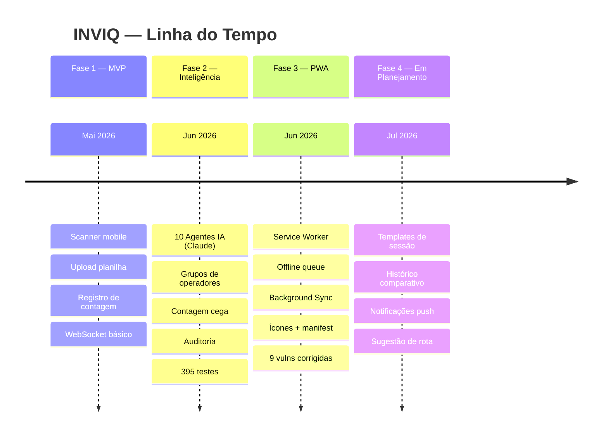
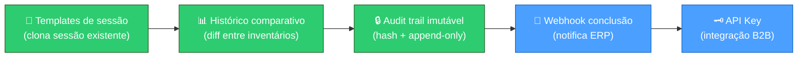

# Roadmap — INVIQ

> [!success] Entregues
> ✅ Scanner mobile PWA · ✅ Contagem cega · ✅ 3 rodadas · ✅ 10 agentes IA
> ✅ WebSocket real-time · ✅ Grupos de operadores · ✅ Export PDF + Excel
> ✅ Service Worker + offline · ✅ 395 testes · ✅ 9 vulnerabilidades corrigidas

---

## Estado das Fases

---

## Próximas Features por Prioridade

### Alta Prioridade (Impacto Imediato)

| Feature | Impacto | Esforço | Depende de |
|---------|---------|---------|-----------|
| **Templates de sessão** | Admin reutiliza planilha sem re-upload | Médio | [[02 - Banco de Dados]] |
| **Histórico comparativo** | Diff SKU a SKU entre inventários | Médio | [[02 - Banco de Dados]] |
| **Audit trail imutável** | Log com hash — requisito fiscal | Médio | [[07 - Segurança]] |

### Média Prioridade (Experiência)

| Feature | Impacto | Esforço | Depende de |
|---------|---------|---------|-----------|
| **Sugestão de rota** | Ordena lista por caminho físico no depósito | Médio | [[04 - Frontend Mobile]] |
| **Notificações push** | Avisar operador sem aba aberta | Médio | [[09 - PWA & Offline]] |
| **Câmera DataMatrix/Code128** | Leitura de código de barras linear | Alto | [[04 - Frontend Mobile]] |

### Qualidade Técnica

| Feature | Impacto | Esforço |
|---------|---------|---------|
| **Testes E2E (Playwright)** | Fluxo scan→conta→export testado | Alto |
| **Testes frontend** | 1.650 linhas JS sem cobertura | Alto |
| **IndexedDB para offline** | Substitui localStorage (limite 5MB) | Médio |

### Escalabilidade

| Feature | Impacto | Esforço |
|---------|---------|---------|
| **Webhook de conclusão** | Notifica ERP automaticamente | Baixo |
| **API Key para integração** | Parceiros sem acesso humano | Baixo |
| **Multi-tenancy** | Isolar por empresa (SaaS) | Alto |

---

## Recomendação de Próxima Sprint

**Sprint recomendada:** Templates + Histórico + Audit Trail
→ 3 features complementares, esforço médio, resolvem dor real do segundo inventário em diante

---

## Conexões

- [[00 - INVIQ]] — visão geral do sistema
- [[05 - Agentes IA]] — novos agentes planejados (RouteAgent, TemplateAgent)
- [[09 - PWA & Offline]] — IndexedDB, notificações push
- [[12 - Testes]] — E2E e testes frontend pendentes
- [[02 - Banco de Dados]] — novas tabelas para templates e histórico
