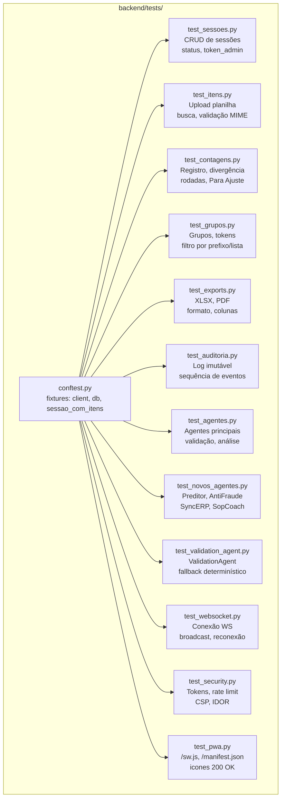

# Testes — INVIQ

> [!success] Estado Atual
> **395 testes passando** · 1 skipped · 0 falhas
> **Runner:** pytest 8.x · **Tempo médio:** ~100s (testes de integração com DB real)
> **Cobertura:** Backend completo · Frontend: zero (gap conhecido)

---

## Estrutura de Testes



---

## Fixtures Principais

```python
# conftest.py
@pytest.fixture
def client(db):
    """TestClient com DB de teste isolado."""
    app.dependency_overrides[get_db] = lambda: db
    return TestClient(app)

@pytest.fixture
def sessao_com_itens(client):
    """Sessão ativa com 10 itens pré-importados."""
    sessao = client.post("/api/sessoes", json={...}).json()
    client.post(f"/api/sessoes/{sessao['id']}/upload", ...)
    return sessao

@pytest.fixture
def sessao_com_grupo(client, sessao_com_itens):
    """Sessão com grupo de operadores configurado."""
    grupo = client.post(f"/api/sessoes/{sessao_com_itens['id']}/grupos", ...)
    return {**sessao_com_itens, "grupo": grupo.json()}
```

---

## Cobertura por Módulo

| Módulo | Testes | Cobertura |
|--------|--------|-----------|
| `routes/sessoes.py` | ~40 | ✅ Alta |
| `routes/itens.py` | ~35 | ✅ Alta |
| `routes/contagens.py` | ~45 | ✅ Alta |
| `routes/grupos.py` | ~30 | ✅ Alta |
| `routes/exports.py` | ~20 | ✅ Média |
| `routes/agentes.py` | ~25 | ✅ Média |
| `agents/*.py` | ~60 | ✅ Alta (fallback) |
| `mobile.html (JS)` | 0 | ❌ Zero |
| Fluxo E2E completo | 0 | ❌ Zero |

---

## Como Rodar

```bash
# Rodar todos os testes
cd backend
pytest tests/ -q

# Com cobertura
pytest tests/ --cov=app --cov-report=html

# Só um módulo
pytest tests/test_contagens.py -v

# Parar no primeiro erro
pytest tests/ -x --tb=short
```

---

## Gaps de Cobertura (Roadmap)

> [!warning] Testes Frontend (Gap Crítico)
> `mobile.html` tem ~1.650 linhas de JS sem nenhum teste.
> Regressões de UX (estados, scanner, lista) são invisíveis.
> **Solução:** Playwright ou Vitest + jsdom

> [!warning] Testes E2E (Gap Crítico)
> Nenhum teste cobre o fluxo completo: criar sessão → upload → escanear → contar → exportar.
> **Solução:** Playwright end-to-end com browser real

---

## Conexões

- [[03 - Backend]] — testes de integração por endpoint
- [[05 - Agentes IA]] — `test_novos_agentes.py`, `test_validation_agent.py`
- [[10 - Deploy & Infra]] — CI pode rodar suite antes do deploy
- [[11 - Roadmap]] — Playwright e testes frontend no backlog
- [[00 - INVIQ]] — visão geral
